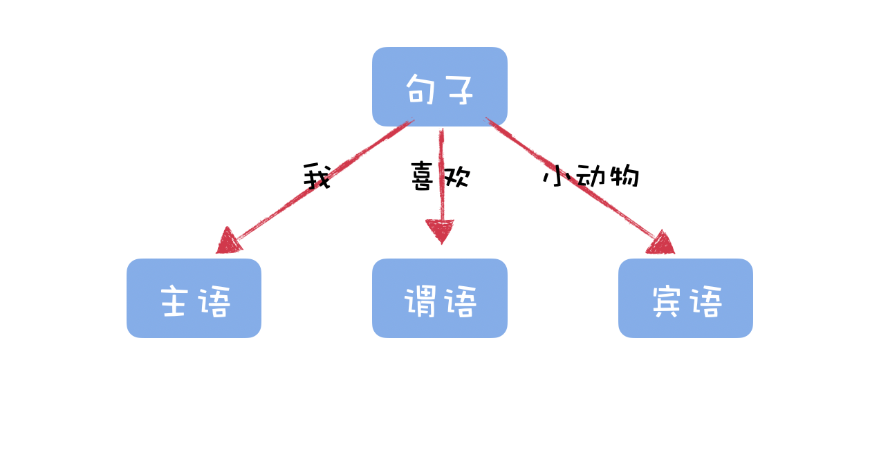
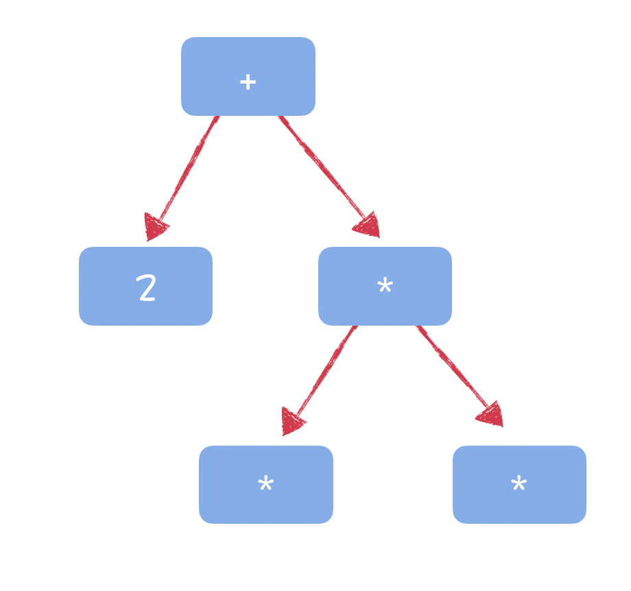
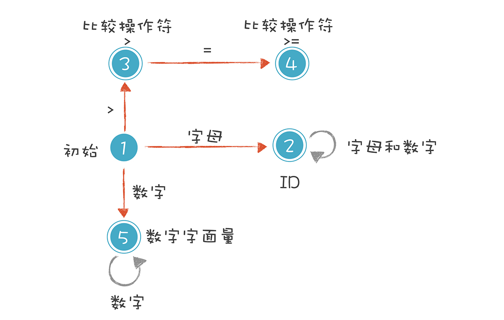
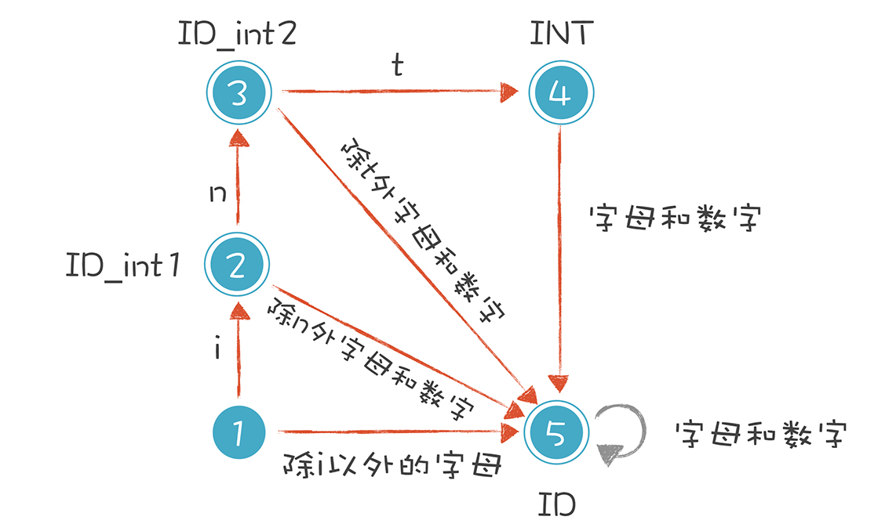
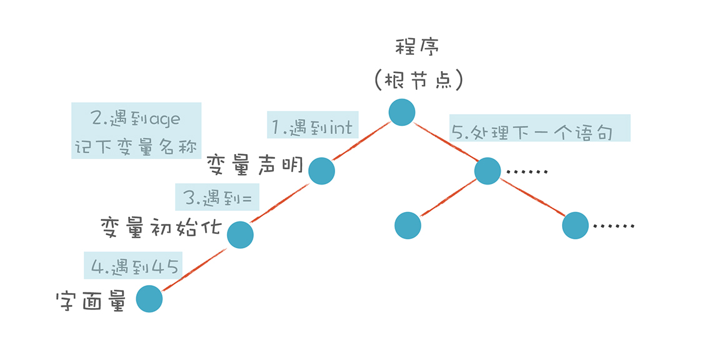
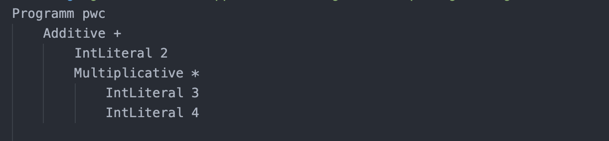
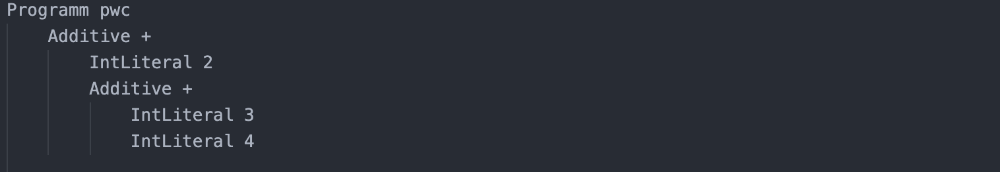
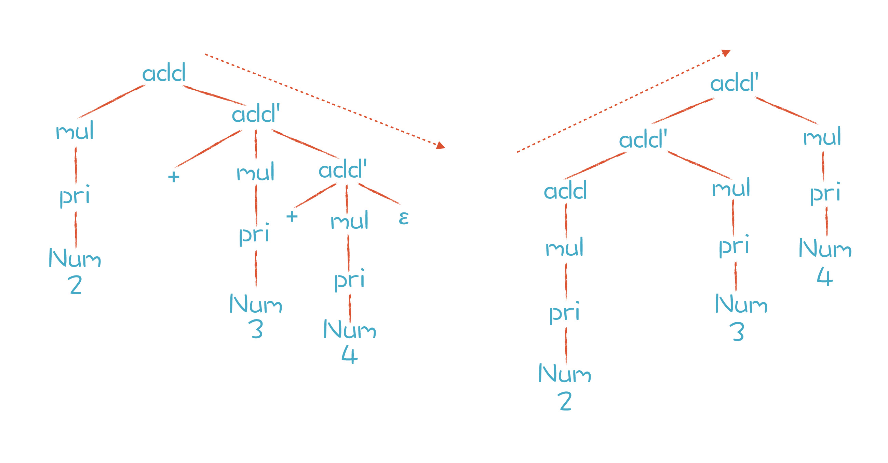

### 初识编译原理

#### 1、编译原理

编译原理就是解释把人能理解的代码翻译成计算机能理解的代码的过程的一门学科。

#### 2、编译原理的构成


#### 3、词法分析

词法分析简单来说就是通过程序提取出一个词法记号(token)，跟我们汉语相比较的话，`我喜欢小动物`这句话我们就能提取出主谓宾，主语就是我、谓语就是喜欢，宾语就是小动物。



每个程序语言也有既定的语法结构，我们同样能解析出这样一个树形结构，**`2+3*4`**



在编译原理中这颗树就叫做**`抽象语法树(Abstract Syntax Tree，AST)`**。而词法分析器就是把编写的代码文本解析成书上的一个一个节点（Token）。

##### （一）解析**age >= 45;**


- 标识符：第一个字符必须是字母，后面的字符可以是字母或数字。
- 比较操作符：> 和 >=
- 数字字面量：全部由数字构成


##### （二）有限自动机

当我们解析**`age >= 45`**时已经考虑状态的改变，我们根据这些状态改变可以总结出一份状态转移图:



根据这个状态转移图我们就可以写出自动机来解析代码文本了。

##### （三）关键字怎么办

如果我们按照上面的状态转移图解析**`int age = 40;`** 那么我们就会有一个解析错误，**`int`**这个关键字就会被解析成标识符。

所以我们要修改上面的状态转移图：



#### 4、语法分析

##### (一) 简单推导

通过词法分析我们就得到了一个按顺序的token数组，语法分析就是根据这个token数组来解析，看看有没有语法错误，解析结果、生成AST。

我们先看一下根据以**`int age = 45`**开始的代码文本示意图：



那么赋值语句的推导过程是：

```
intDeclaration : Int Identifier ('=' additiveExpression)?;

// 伪代码
MatchToken(Int);   // 匹配Int关键字
MatchIdentifier(); // 匹配标识符
MatchToken(equal); // 匹配等号
MatchExpression(); // 匹配表达式
```

##### （二）表达式推导

当我们要解析`2+3*5`算数表达式的时候该怎么办呢？

```

additiveExpression
    :   multiplicativeExpression
    |   additiveExpression Plus multiplicativeExpression
    ;

multiplicativeExpression
    :   IntLiteral
    |   multiplicativeExpression Star IntLiteral
    ;
```

那么我么推到的过程就能用下面的表达式完成：

```

-->additiveExpression + multiplicativeExpression
-->multiplicativeExpression + multiplicativeExpression
-->IntLiteral + multiplicativeExpression
-->IntLiteral + multiplicativeExpression * IntLiteral 
-->IntLiteral + IntLiteral * IntLiteral
```

但是这个推导式式无限递归的，其中multiplicativeExpression => multiplicativeExpression Star IntLiteral 的左边第一部分递归的调用自己那么就会无限的下去，这种情况就叫做左递归。

那么怎么才能把无限递归的问题解决呢？

就是把调用自己的部分放在右边就可以了

```
additiveExpression
    :   multiplicativeExpression
    |   multiplicativeExpression Plus additiveExpression
    ;

multiplicativeExpression
    :   IntLiteral
    |   IntLiteral Star multiplicativeExpression
    ;
```


那么现在是解析出来了AST，**`2+3*4`**的结果是这样的：



****

**`2+3+4`**的结果是啥样的呢：



这就出现了结合性的问题：本来应该先做2+3得出5，然后5和4相加得到9，但是我们解析出来的AST是先计算3+4，这就出现了问题。

##### （三）结合性

我们可以先把上面的表达式精简一下，改成巴科斯范式：

```
add -> mul | add '+' mul
mul -> pri | mul '*' pri
pri -> Id | Num | (add)

# add 的语法还可以精简 改成扩展巴科斯范式
add -> mul ('+' mul)*
```

上面讲到要进行表达是的推导就要避免左递归，但是左递归会结合性的问题。

我们如果使用左递归，就不会出现结合性的问题。

那我们要解决结合性的问题就要消除左递归。

```
add -> mul add'
add' -> '+' mul add' | ε
```

按照这个规则我们再来推导一下**`2+3+4`**



左边的分析树是推导后的结果。问题是，由于 add’的规则是右递归的，如果用标准的递归下降算法，我们会跟上一讲一样，又会出现运算符结合性的错误。我们期待的 AST 是右边的那棵，它的结合性才是正确的。那么有没有解决办法呢？


仔细分析一下上面语法规则的推导过程。只有第一步是按照 add 规则推导，之后都是按照 add’规则推导，一直到结束。推导式可以简化成：

```
add -> mul ('+' mul)*
```

那么我们就可以用写成循环的形式，而不用一次次的递归，伪代码：

```
mul();
while(next token is +){
  mul()
  createAddNode
}
```

